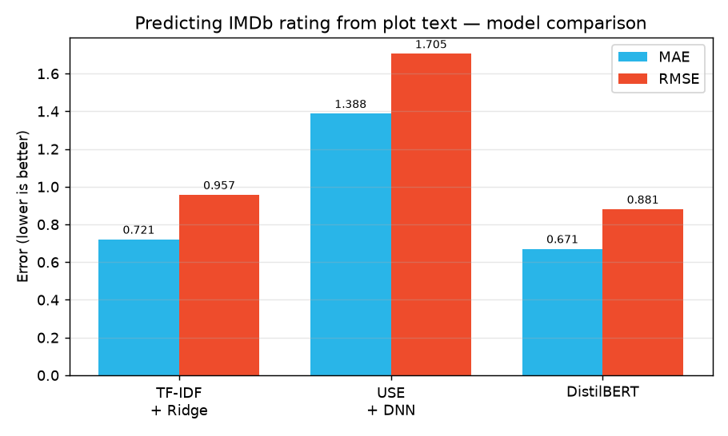

# 🎥 Can you predict a movie's IMDb rating from its plot alone?

A focused NLP study that answers one question: **how well can a model predict a film's IMDb rating (0-10) using only its plot description?** Three approaches of increasing sophistication are put head-to-head on the same task and the same split - from a classic sparse baseline to a fine-tuned transformer.

The interesting part isn't just *which* wins - it's *by how little*.

---

## 📊 Results

Trained on the [IMDB-Movie-Data](https://www.kaggle.com/datasets/PromptCloudHQ/imdb-data) dataset (~1000 films, 80/20 split). Lower error is better.

| Model | MAE ↓ | RMSE ↓ | R² ↑ |
|-------|:----:|:-----:|:---:|
| TF-IDF + Ridge (baseline) | 0.721 | 0.957 | 0.045 |
| Universal Sentence Encoder + DNN | 1.388 | 1.705 | −2.034 |
| **DistilBERT (fine-tuned)** | **0.671** | **0.881** | - |



---

## 💡 What the numbers actually say

1. **The transformer wins - but only just.** DistilBERT (MAE 0.671) beats a plain TF-IDF + Ridge baseline (MAE 0.721) by **~0.05 of a rating point**. For the effort and compute a fine-tuned transformer costs, that's a humbling margin.
2. **More complexity is not automatically better.** The mid-complexity USE + DNN was the **worst** model (negative R² - it did worse than predicting the mean). Dense nets on frozen sentence embeddings overfit this small dataset.
3. **The task itself is hard.** Even the best model explains little variance. A plot summary carries only weak signal about a film's rating - cast, genre, budget and era matter more. The honest conclusion: **text alone is a weak predictor of rating**, and a simple baseline is a strong, cheap reference point.

> Takeaway: always benchmark against a simple baseline before reaching for heavy models.

---

## 🧪 The three approaches

| Approach | Idea | Stack |
|----------|------|-------|
| **TF-IDF + Ridge** | Sparse bag-of-words → linear regression | scikit-learn |
| **USE + DNN** | 512-d semantic embeddings → dense net | TensorFlow Hub, Keras |
| **DistilBERT** | Fine-tuned transformer regression head | 🤗 Transformers, PyTorch |

---

## 🚀 Run it

```bash
pip install -r requirements.txt

# Baseline on the bundled sample (smoke test)
python src/train.py --data data/sample_movies.csv --model tfidf

# Full dataset (see data/README.md to download it), and save the model
python src/train.py --data IMDB-Movie-Data.csv --model tfidf --save model.joblib

# Predict a rating from a plot description
python src/predict.py model.joblib "A thief who steals corporate secrets through dream-sharing tech."
# -> Predicted IMDb rating: 8.20 / 10
```

Regenerate the chart from `results/metrics.json`:
```bash
python src/make_results_chart.py
```

---

## 🗂️ Structure

```
src/
  preprocess.py        text cleaning + data loading
  models.py            the 3 model builders (USE/DistilBERT import lazily)
  train.py             train + evaluate (MAE / RMSE / R²)
  predict.py           predict a rating from a description
  make_results_chart.py
data/                  bundled sample + how to get the full dataset
results/metrics.json   the reported metrics
assets/                generated comparison chart
notebooks/             original exploratory notebook
```

---

## 🛠️ Tech Stack


---

## 📄 License

Released under the [MIT License](LICENSE).
